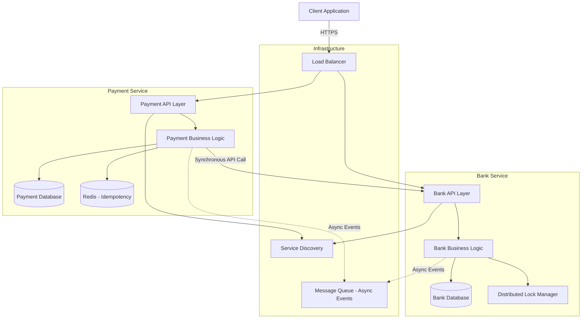
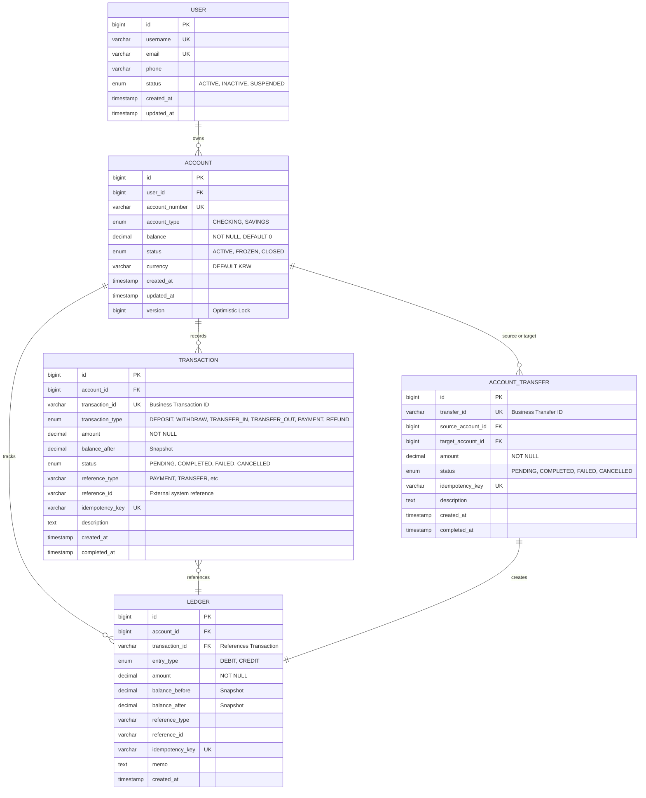
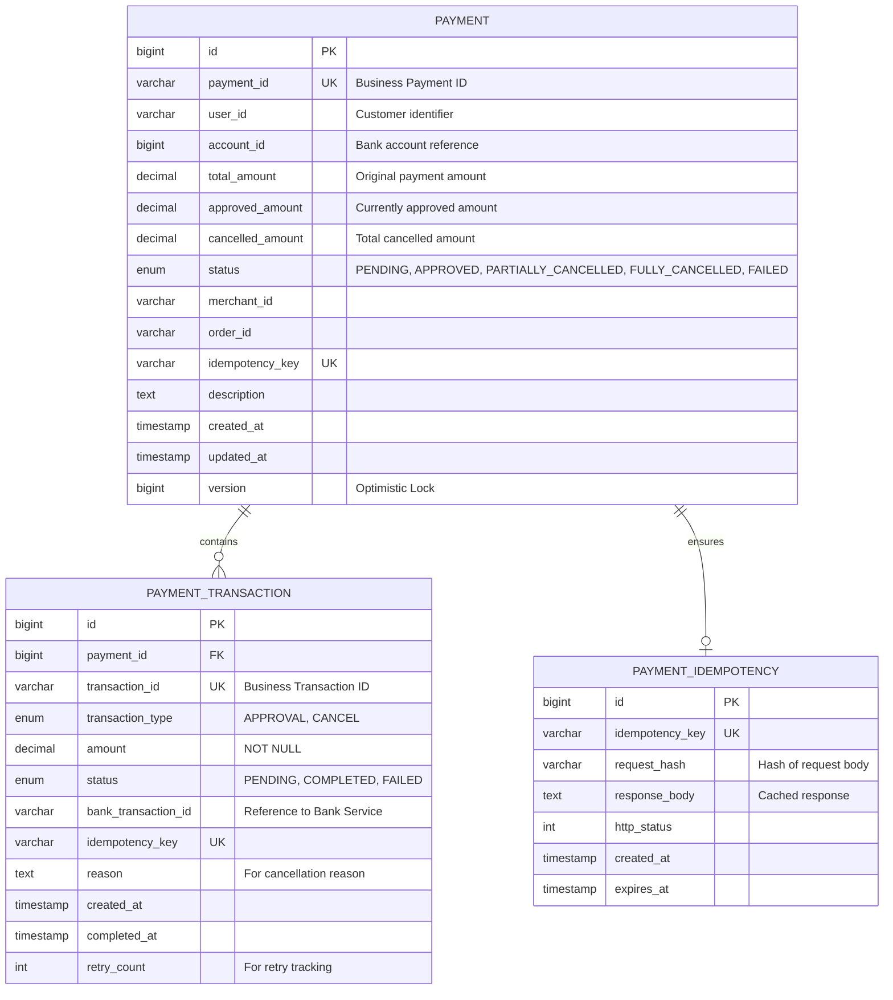
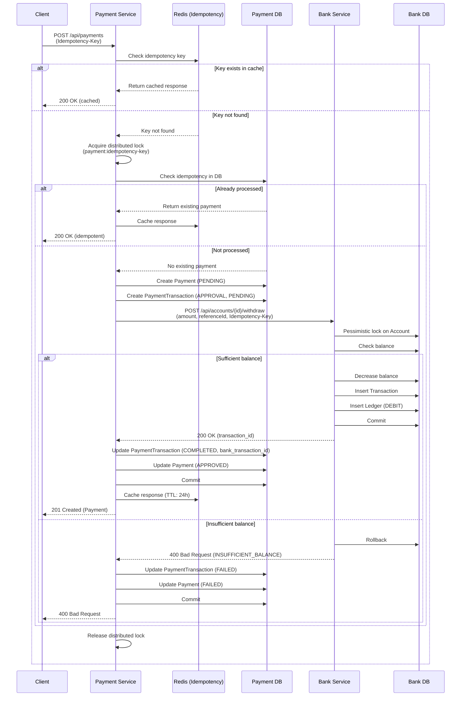
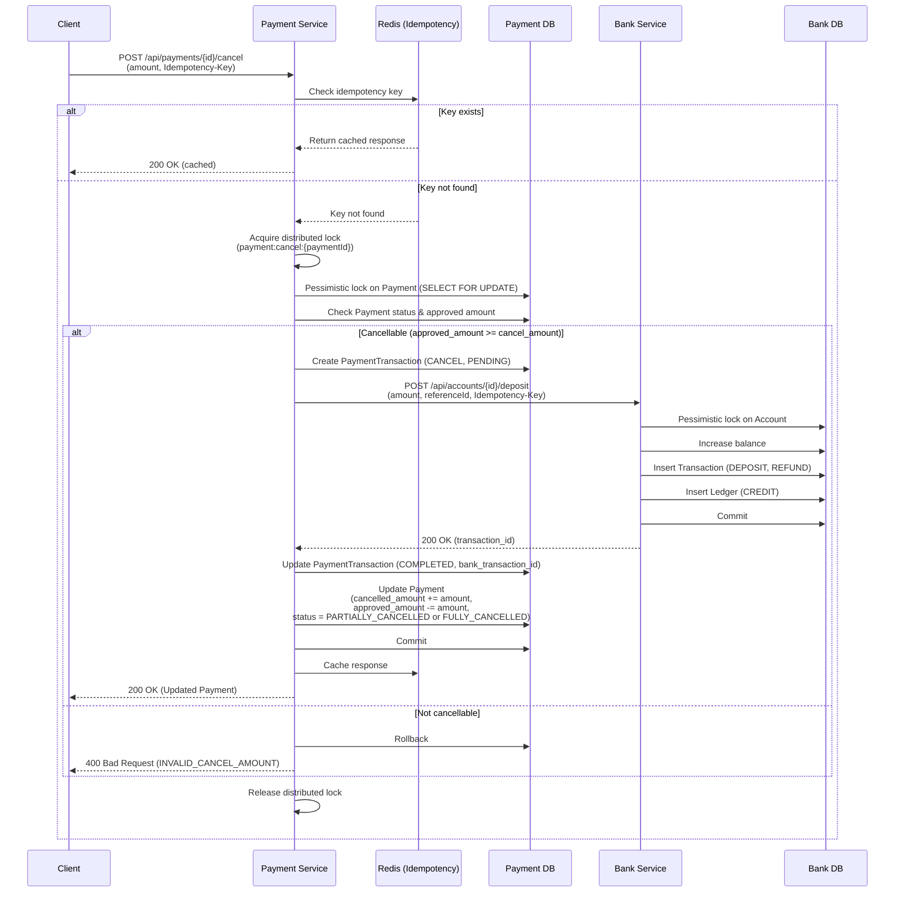

# Bank & Payment System Architecture

## 1. System Overview

The Bank & Payment System is a distributed microservices architecture consisting of two independent services:
- **Bank Service**: Manages accounts, deposits, withdrawals, and ledger
- **Payment Service**: Handles payment approval, cancellation, and queries

### Key Design Goals
1. **Idempotency**: All operations support client-provided idempotency keys
2. **Partial Cancellation**: Support multiple partial cancellations
3. **Concurrency**: Handle distributed environment with scale up/down
4. **Data Consistency**: Enable reconciliation between Bank and Payment services
5. **Account Transfer**: Design considerations (implementation: TODO)

---

## 2. System Architecture



### Architecture Characteristics

- **Service Independence**: Each service has its own database (no shared database)
- **Synchronous Communication**: Payment → Bank via REST API
- **Asynchronous Events**: For reconciliation and auditing (optional)
- **Stateless Services**: Enable horizontal scaling
- **Distributed Lock**: For critical section protection across instances

---

## 3. Bank Service ERD



### Bank Service Key Design Decisions

1. **Dual Recording System**
   - `TRANSACTION`: Business-level transaction record
   - `LEDGER`: Immutable accounting entry (double-entry bookkeeping ready)

2. **Balance Management**
   - Current balance stored in `ACCOUNT.balance`
   - Historical balance snapshots in `TRANSACTION.balance_after` and `LEDGER.balance_after`
   - Enables balance verification and audit trail

3. **Account Transfer Preparation**
   - `ACCOUNT_TRANSFER` table for transfer operations
   - Links to both source and target accounts
   - Creates corresponding LEDGER entries for both accounts
   - `transaction_type`: TRANSFER_IN, TRANSFER_OUT

4. **Optimistic Locking**
   - `ACCOUNT.version` for concurrent balance updates
   - Prevents lost update problem

5. **Idempotency Support**
   - `idempotency_key` in TRANSACTION, LEDGER, and ACCOUNT_TRANSFER
   - Unique constraint ensures operation executed only once

---

## 4. Payment Service ERD



### Payment Service Key Design Decisions

1. **Aggregate Payment Information**
   - `PAYMENT`: Aggregate root tracking overall payment state
   - `total_amount`: Original payment amount
   - `approved_amount`: Currently valid amount (total - cancelled)
   - `cancelled_amount`: Sum of all cancellations

2. **Transaction History**
   - `PAYMENT_TRANSACTION`: Each approval/cancellation is a separate transaction
   - Supports multiple partial cancellations
   - Links to Bank Service transaction via `bank_transaction_id`

3. **Status Transitions**
   ```
   PENDING → APPROVED → PARTIALLY_CANCELLED → FULLY_CANCELLED
   PENDING → FAILED
   ```

4. **Idempotency Cache**
   - Separate `PAYMENT_IDEMPOTENCY` table for fast lookups
   - Stores request hash and cached response
   - TTL-based expiration (`expires_at`)
   - Can be moved to Redis for better performance

5. **Reconciliation Support**
   - `bank_transaction_id`: Links Payment to Bank transactions
   - `approved_amount` vs `cancelled_amount`: Easy verification
   - Transaction timestamps for temporal reconciliation

---

## 5. Concurrency Control Strategy

### 5.1 Optimistic Locking

**Use Cases**: Low contention scenarios
- Balance updates in off-peak hours
- User profile updates
- Configuration changes

**Implementation**:
```kotlin
@Entity
data class Account(
    @Id
    val id: Long,

    @Version
    val version: Long = 0,  // JPA managed version

    var balance: BigDecimal
)

// In service layer
fun withdraw(accountId: Long, amount: BigDecimal): Account {
    val account = accountRepository.findById(accountId)
    account.balance = account.balance - amount

    try {
        return accountRepository.save(account)  // Throws OptimisticLockException if version mismatch
    } catch (e: OptimisticLockException) {
        // Retry logic or return error
        throw ConcurrentModificationException("Account was modified by another transaction")
    }
}
```

**Pros**:
- No database locks
- Better throughput for low contention
- Suitable for distributed systems

**Cons**:
- Requires retry logic
- May fail frequently under high contention

### 5.2 Pessimistic Locking

**Use Cases**: High contention scenarios
- Payment processing peak hours
- Concurrent withdrawals on same account
- Critical balance updates

**Implementation**:
```kotlin
interface AccountRepository : JpaRepository<Account, Long> {
    @Lock(LockModeType.PESSIMISTIC_WRITE)
    @Query("SELECT a FROM Account a WHERE a.id = :id")
    fun findByIdForUpdate(id: Long): Account?
}

// In service layer
@Transactional
fun withdraw(accountId: Long, amount: BigDecimal): Account {
    val account = accountRepository.findByIdForUpdate(accountId)
        ?: throw AccountNotFoundException()

    if (account.balance < amount) {
        throw InsufficientBalanceException()
    }

    account.balance = account.balance - amount
    return accountRepository.save(account)
}
```

**Pros**:
- Guaranteed consistency
- No retry needed
- Suitable for high contention

**Cons**:
- Holds database locks
- May cause deadlocks
- Reduced throughput

### 5.3 Distributed Locking (Redis/Redlock)

**Use Cases**: Cross-instance coordination
- Preventing duplicate payment processing
- Idempotency enforcement
- Batch job coordination

**Implementation**:
```kotlin
@Service
class DistributedLockService(
    private val redissonClient: RedissonClient
) {
    fun <T> executeWithLock(
        lockKey: String,
        waitTime: Long = 3000,
        leaseTime: Long = 10000,
        block: () -> T
    ): T {
        val lock = redissonClient.getLock(lockKey)

        try {
            val acquired = lock.tryLock(waitTime, leaseTime, TimeUnit.MILLISECONDS)
            if (!acquired) {
                throw LockAcquisitionException("Failed to acquire lock: $lockKey")
            }

            return block()
        } finally {
            if (lock.isHeldByCurrentThread) {
                lock.unlock()
            }
        }
    }
}

// Usage
fun processPayment(idempotencyKey: String, request: PaymentRequest): Payment {
    return distributedLockService.executeWithLock("payment:$idempotencyKey") {
        // Check idempotency
        val existing = paymentRepository.findByIdempotencyKey(idempotencyKey)
        if (existing != null) {
            return@executeWithLock existing
        }

        // Process payment
        createPayment(request)
    }
}
```

### 5.4 Hybrid Approach (Recommended)

Combine strategies based on operation type:

| Operation | Strategy | Reason |
|-----------|----------|--------|
| Payment Approval | Distributed Lock + Optimistic | Idempotency + Balance check |
| Account Withdrawal | Pessimistic Lock | High contention, critical operation |
| Balance Query | No Lock | Read-only, stale read acceptable |
| Payment Cancellation | Distributed Lock + Optimistic | Prevent duplicate cancellation |
| Ledger Insert | No Lock | Append-only, immutable |

---

## 6. Idempotency Strategy

### 6.1 Idempotency Key Management

**Client Responsibilities**:
- Generate unique idempotency key (UUID v4 recommended)
- Include in HTTP header: `Idempotency-Key: <uuid>`
- Retry with same key on network failure

**Server Responsibilities**:
- Validate key format
- Store key with operation result
- Return cached result for duplicate requests

### 6.2 Implementation Layers

#### Layer 1: API Gateway / Filter (Fast Path)
```kotlin
@Component
class IdempotencyFilter : OncePerRequestFilter() {

    @Autowired
    private lateinit var redisTemplate: RedisTemplate<String, String>

    override fun doFilterInternal(
        request: HttpServletRequest,
        response: HttpServletResponse,
        filterChain: FilterChain
    ) {
        val idempotencyKey = request.getHeader("Idempotency-Key")

        if (idempotencyKey.isNullOrBlank()) {
            // For non-idempotent operations, proceed
            filterChain.doFilter(request, response)
            return
        }

        // Check Redis cache
        val cacheKey = "idempotency:${request.method}:${request.requestURI}:$idempotencyKey"
        val cachedResponse = redisTemplate.opsForValue().get(cacheKey)

        if (cachedResponse != null) {
            // Return cached response
            response.contentType = "application/json"
            response.status = HttpStatus.OK.value()
            response.writer.write(cachedResponse)
            return
        }

        // Wrap response to capture output
        val responseWrapper = ContentCachingResponseWrapper(response)
        filterChain.doFilter(request, responseWrapper)

        // Cache successful response
        if (responseWrapper.status in 200..299) {
            val responseBody = String(responseWrapper.contentAsByteArray)
            redisTemplate.opsForValue().set(
                cacheKey,
                responseBody,
                Duration.ofHours(24)
            )
        }

        responseWrapper.copyBodyToResponse()
    }
}
```

#### Layer 2: Database Constraint (Guarantee Path)
```kotlin
@Entity
@Table(
    uniqueConstraints = [
        UniqueConstraint(columnNames = ["idempotency_key"])
    ]
)
data class Payment(
    @Id
    @GeneratedValue(strategy = GenerationType.IDENTITY)
    val id: Long = 0,

    @Column(nullable = false, unique = true)
    val idempotencyKey: String,

    // other fields...
)

@Service
class PaymentService {
    fun createPayment(request: PaymentRequest): Payment {
        try {
            // Attempt to create with idempotency key
            val payment = Payment(
                idempotencyKey = request.idempotencyKey,
                amount = request.amount
            )
            return paymentRepository.save(payment)

        } catch (e: DataIntegrityViolationException) {
            // Duplicate key - return existing payment
            return paymentRepository.findByIdempotencyKey(request.idempotencyKey)
                ?: throw IllegalStateException("Idempotency key exists but payment not found")
        }
    }
}
```

### 6.3 Idempotency Key Scope

| Operation | Key Scope | Example |
|-----------|-----------|---------|
| Payment Approval | Per payment | `payment:approve:{uuid}` |
| Payment Cancellation | Per cancellation | `payment:cancel:{paymentId}:{uuid}` |
| Account Deposit | Per deposit | `account:deposit:{accountId}:{uuid}` |
| Account Withdrawal | Per withdrawal | `account:withdraw:{accountId}:{uuid}` |

### 6.4 Idempotency Window

- **Cache TTL**: 24 hours (configurable)
- **Database Retention**: Indefinite (for audit)
- **Cleanup Strategy**:
  - Redis: TTL-based expiration
  - Database: Archive old records (> 90 days) to separate table

---

## 7. Reconciliation Strategy

### 7.1 Reconciliation Requirements

**Goal**: Ensure Bank and Payment services maintain consistent financial data

**Reconciliation Points**:
1. Daily reconciliation: End-of-day batch
2. Real-time alerts: Threshold-based monitoring
3. Manual reconciliation: On-demand investigation

### 7.2 Data Matching Strategy

#### Approach 1: Transaction ID Matching
```sql
-- Payment Service Query
SELECT
    p.payment_id,
    p.approved_amount,
    p.cancelled_amount,
    pt.transaction_id AS payment_transaction_id,
    pt.bank_transaction_id,
    pt.amount,
    pt.transaction_type
FROM payment p
JOIN payment_transaction pt ON p.id = pt.payment_id
WHERE pt.created_at >= '2026-03-08 00:00:00'
  AND pt.created_at < '2026-03-09 00:00:00'
  AND pt.status = 'COMPLETED';

-- Bank Service Query
SELECT
    t.transaction_id,
    t.account_id,
    t.amount,
    t.transaction_type,
    t.reference_type,
    t.reference_id,
    l.balance_after
FROM transaction t
JOIN ledger l ON t.transaction_id = l.transaction_id
WHERE t.reference_type = 'PAYMENT'
  AND t.created_at >= '2026-03-08 00:00:00'
  AND t.created_at < '2026-03-09 00:00:00'
  AND t.status = 'COMPLETED';

-- Reconciliation Logic
-- 1. Match by bank_transaction_id (Payment) = transaction_id (Bank)
-- 2. Verify amounts match
-- 3. Verify transaction types correspond (APPROVAL → WITHDRAW, CANCEL → DEPOSIT)
-- 4. Flag discrepancies for investigation
```

#### Approach 2: Temporal Matching
- Match transactions within time window (±5 minutes)
- Use amount as secondary key
- Useful when transaction ID linkage is missing

#### Approach 3: Aggregate Matching
```sql
-- Payment Service Daily Summary
SELECT
    DATE(created_at) AS date,
    SUM(CASE WHEN transaction_type = 'APPROVAL' THEN amount ELSE 0 END) AS total_approvals,
    SUM(CASE WHEN transaction_type = 'CANCEL' THEN amount ELSE 0 END) AS total_cancellations,
    COUNT(*) AS transaction_count
FROM payment_transaction
WHERE status = 'COMPLETED'
  AND created_at >= '2026-03-08 00:00:00'
  AND created_at < '2026-03-09 00:00:00'
GROUP BY DATE(created_at);

-- Bank Service Daily Summary
SELECT
    DATE(created_at) AS date,
    SUM(CASE WHEN reference_type = 'PAYMENT' AND entry_type = 'DEBIT' THEN amount ELSE 0 END) AS total_withdrawals,
    SUM(CASE WHEN reference_type = 'PAYMENT' AND entry_type = 'CREDIT' THEN amount ELSE 0 END) AS total_deposits,
    COUNT(*) AS transaction_count
FROM ledger
WHERE reference_type = 'PAYMENT'
  AND created_at >= '2026-03-08 00:00:00'
  AND created_at < '2026-03-09 00:00:00'
GROUP BY DATE(created_at);

-- Verify: total_approvals = total_withdrawals
--         total_cancellations = total_deposits
```

### 7.3 Reconciliation Implementation

```kotlin
data class ReconciliationResult(
    val date: LocalDate,
    val matched: List<MatchedTransaction>,
    val unmatchedInPayment: List<PaymentTransaction>,
    val unmatchedInBank: List<BankTransaction>,
    val amountDiscrepancies: List<DiscrepancyReport>,
    val summary: ReconciliationSummary
)

data class ReconciliationSummary(
    val totalPaymentTransactions: Int,
    val totalBankTransactions: Int,
    val matchedCount: Int,
    val unmatchedCount: Int,
    val totalAmountDifference: BigDecimal
)

@Service
class ReconciliationService(
    private val paymentClient: PaymentServiceClient,
    private val bankRepository: BankTransactionRepository
) {

    fun reconcileDaily(date: LocalDate): ReconciliationResult {
        // 1. Fetch data from both services
        val paymentTransactions = paymentClient.getTransactionsByDate(date)
        val bankTransactions = bankRepository.findByDateAndReferenceType(date, "PAYMENT")

        // 2. Build lookup maps
        val bankMap = bankTransactions.associateBy { it.transactionId }
        val paymentMap = paymentTransactions.associateBy { it.bankTransactionId }

        // 3. Match transactions
        val matched = mutableListOf<MatchedTransaction>()
        val unmatchedInPayment = mutableListOf<PaymentTransaction>()
        val unmatchedInBank = mutableListOf<BankTransaction>()
        val discrepancies = mutableListOf<DiscrepancyReport>()

        // Match from Payment perspective
        paymentTransactions.forEach { payment ->
            val bank = bankMap[payment.bankTransactionId]
            if (bank != null) {
                // Verify amounts
                if (payment.amount != bank.amount) {
                    discrepancies.add(
                        DiscrepancyReport(
                            paymentTransactionId = payment.transactionId,
                            bankTransactionId = bank.transactionId,
                            paymentAmount = payment.amount,
                            bankAmount = bank.amount,
                            difference = payment.amount - bank.amount
                        )
                    )
                }
                matched.add(MatchedTransaction(payment, bank))
            } else {
                unmatchedInPayment.add(payment)
            }
        }

        // Find unmatched Bank transactions
        bankTransactions.forEach { bank ->
            if (!paymentMap.containsKey(bank.transactionId)) {
                unmatchedInBank.add(bank)
            }
        }

        // 4. Generate report
        return ReconciliationResult(
            date = date,
            matched = matched,
            unmatchedInPayment = unmatchedInPayment,
            unmatchedInBank = unmatchedInBank,
            amountDiscrepancies = discrepancies,
            summary = ReconciliationSummary(
                totalPaymentTransactions = paymentTransactions.size,
                totalBankTransactions = bankTransactions.size,
                matchedCount = matched.size,
                unmatchedCount = unmatchedInPayment.size + unmatchedInBank.size,
                totalAmountDifference = discrepancies.sumOf { it.difference }
            )
        )
    }
}
```

### 7.4 Discrepancy Handling

1. **Automated Resolution**:
   - Retry failed transactions (idempotent)
   - Auto-correct timing issues (delayed updates)

2. **Manual Investigation**:
   - Flag for operations team review
   - Provide detailed transaction trail
   - Support manual adjustment

3. **Alerting**:
   - Real-time alerts for large discrepancies (> threshold)
   - Daily summary email
   - Dashboard for monitoring

---

## 8. Distributed Environment Considerations

### 8.1 Service Discovery

**Options**:
- **Netflix Eureka**: Service registration and discovery
- **Consul**: Service mesh with health checking
- **Kubernetes Service**: Native K8s service discovery

**Configuration**:
```yaml
# application.yml (Payment Service)
eureka:
  client:
    service-url:
      defaultZone: http://eureka-server:8761/eureka/
  instance:
    prefer-ip-address: true
    lease-renewal-interval-in-seconds: 10

# Payment → Bank communication
bank-service:
  url: http://bank-service  # Service name, resolved by discovery
```

### 8.2 Load Balancing

**Client-Side Load Balancing** (Spring Cloud LoadBalancer):
```kotlin
@Configuration
class BankClientConfig {

    @Bean
    @LoadBalanced
    fun restTemplate(): RestTemplate {
        return RestTemplate()
    }
}

@Service
class BankServiceClient(
    @LoadBalanced private val restTemplate: RestTemplate
) {
    fun withdraw(accountId: Long, amount: BigDecimal): BankTransaction {
        val url = "http://bank-service/api/accounts/$accountId/withdraw"
        return restTemplate.postForObject(url, WithdrawRequest(amount), BankTransaction::class.java)
            ?: throw BankServiceException("Withdrawal failed")
    }
}
```

### 8.3 Circuit Breaker

**Resilience4j Integration**:
```kotlin
@Service
class BankServiceClient {

    @CircuitBreaker(name = "bankService", fallbackMethod = "withdrawFallback")
    @Retry(name = "bankService")
    @TimeLimiter(name = "bankService")
    fun withdraw(accountId: Long, amount: BigDecimal): BankTransaction {
        // API call to Bank Service
    }

    private fun withdrawFallback(
        accountId: Long,
        amount: BigDecimal,
        exception: Exception
    ): BankTransaction {
        logger.error("Bank service unavailable, marking payment as pending", exception)

        // Return pending transaction, to be processed later
        throw PaymentPendingException("Bank service temporarily unavailable")
    }
}

# application.yml
resilience4j:
  circuitbreaker:
    instances:
      bankService:
        sliding-window-size: 10
        failure-rate-threshold: 50
        wait-duration-in-open-state: 10s
        permitted-number-of-calls-in-half-open-state: 3
  retry:
    instances:
      bankService:
        max-attempts: 3
        wait-duration: 1s
        exponential-backoff-multiplier: 2
  timelimiter:
    instances:
      bankService:
        timeout-duration: 5s
```

### 8.4 Distributed Tracing

**Spring Cloud Sleuth + Zipkin**:
```yaml
# application.yml
spring:
  sleuth:
    sampler:
      probability: 1.0  # 100% sampling in dev, reduce in prod
  zipkin:
    base-url: http://zipkin-server:9411
    enabled: true

# Adds trace-id and span-id to logs
logging:
  pattern:
    level: "%5p [${spring.application.name:},%X{traceId:-},%X{spanId:-}]"
```

**Usage**:
```kotlin
@Service
class PaymentService(
    private val tracer: Tracer
) {
    fun processPayment(request: PaymentRequest): Payment {
        val span = tracer.nextSpan().name("process-payment").start()

        try {
            span.tag("payment.amount", request.amount.toString())
            span.tag("payment.account", request.accountId.toString())

            // Business logic
            val payment = createPayment(request)

            // Call Bank Service (automatically traced)
            bankServiceClient.withdraw(request.accountId, request.amount)

            return payment
        } catch (e: Exception) {
            span.error(e)
            throw e
        } finally {
            span.finish()
        }
    }
}
```

### 8.5 Database Considerations

#### Connection Pooling
```yaml
# application.yml
spring:
  datasource:
    hikari:
      maximum-pool-size: 20  # Adjust based on instance count
      minimum-idle: 5
      connection-timeout: 30000
      idle-timeout: 600000
      max-lifetime: 1800000
```

#### Read Replicas
```kotlin
@Configuration
class DataSourceConfig {

    @Bean
    @Primary
    fun routingDataSource(
        @Qualifier("primaryDataSource") primary: DataSource,
        @Qualifier("replicaDataSource") replica: DataSource
    ): DataSource {
        val routing = ReplicationRoutingDataSource()

        val sources = mapOf(
            "primary" to primary,
            "replica" to replica
        )

        routing.setTargetDataSources(sources as Map<Any, Any>)
        routing.setDefaultTargetDataSource(primary)

        return routing
    }
}

class ReplicationRoutingDataSource : AbstractRoutingDataSource() {
    override fun determineCurrentLookupKey(): Any {
        return if (TransactionSynchronizationManager.isCurrentTransactionReadOnly()) {
            "replica"
        } else {
            "primary"
        }
    }
}

// Usage
@Transactional(readOnly = true)
fun getPaymentById(id: Long): Payment {
    // Routes to replica
    return paymentRepository.findById(id)
}

@Transactional
fun createPayment(request: PaymentRequest): Payment {
    // Routes to primary
    return paymentRepository.save(payment)
}
```

### 8.6 Caching Strategy

**Multi-Level Caching**:

```kotlin
// L1: Local cache (Caffeine)
@Configuration
@EnableCaching
class CacheConfig {

    @Bean
    fun cacheManager(): CacheManager {
        val caffeine = Caffeine.newBuilder()
            .maximumSize(1000)
            .expireAfterWrite(5, TimeUnit.MINUTES)

        return CaffeineCacheManager().apply {
            setCaffeine(caffeine)
        }
    }
}

// L2: Distributed cache (Redis)
@Service
class PaymentService(
    private val redisTemplate: RedisTemplate<String, Payment>
) {

    @Cacheable(value = ["payment"], key = "#id")
    fun getPaymentById(id: Long): Payment {
        // Check Redis first
        val cacheKey = "payment:$id"
        val cached = redisTemplate.opsForValue().get(cacheKey)
        if (cached != null) {
            return cached
        }

        // Fetch from database
        val payment = paymentRepository.findById(id)
            ?: throw PaymentNotFoundException()

        // Cache in Redis
        redisTemplate.opsForValue().set(cacheKey, payment, Duration.ofMinutes(10))

        return payment
    }

    @CacheEvict(value = ["payment"], key = "#payment.id")
    fun updatePayment(payment: Payment): Payment {
        // Evict from Redis
        val cacheKey = "payment:${payment.id}"
        redisTemplate.delete(cacheKey)

        return paymentRepository.save(payment)
    }
}
```

### 8.7 Health Checks

```kotlin
@Component
class BankServiceHealthIndicator(
    private val bankServiceClient: BankServiceClient
) : HealthIndicator {

    override fun health(): Health {
        return try {
            bankServiceClient.healthCheck()
            Health.up()
                .withDetail("bank-service", "Available")
                .build()
        } catch (e: Exception) {
            Health.down()
                .withDetail("bank-service", "Unavailable")
                .withException(e)
                .build()
        }
    }
}

@RestController
@RequestMapping("/actuator")
class ActuatorController {

    @GetMapping("/health")
    fun health(): ResponseEntity<Map<String, Any>> {
        // Custom health check aggregation
        return ResponseEntity.ok(mapOf(
            "status" to "UP",
            "services" to mapOf(
                "database" to "UP",
                "redis" to "UP",
                "bank-service" to "UP"
            )
        ))
    }
}
```

---

## 9. API Design

### 9.1 Bank Service APIs

#### POST /api/accounts
```json
Request:
{
  "userId": 12345,
  "accountType": "CHECKING",
  "currency": "KRW"
}

Response (201):
{
  "id": 100,
  "accountNumber": "1234567890",
  "userId": 12345,
  "accountType": "CHECKING",
  "balance": 0,
  "currency": "KRW",
  "status": "ACTIVE",
  "createdAt": "2026-03-08T10:00:00Z"
}
```

#### POST /api/accounts/{accountId}/deposit
```json
Request:
Headers:
  Idempotency-Key: 550e8400-e29b-41d4-a716-446655440000

{
  "amount": 10000,
  "description": "Initial deposit"
}

Response (200):
{
  "transactionId": "TXN-1001",
  "accountId": 100,
  "transactionType": "DEPOSIT",
  "amount": 10000,
  "balanceAfter": 10000,
  "status": "COMPLETED",
  "createdAt": "2026-03-08T10:05:00Z"
}
```

#### POST /api/accounts/{accountId}/withdraw
```json
Request:
Headers:
  Idempotency-Key: 650e8400-e29b-41d4-a716-446655440001

{
  "amount": 3000,
  "referenceType": "PAYMENT",
  "referenceId": "PAY-5001",
  "description": "Payment withdrawal"
}

Response (200):
{
  "transactionId": "TXN-1002",
  "accountId": 100,
  "transactionType": "WITHDRAW",
  "amount": 3000,
  "balanceAfter": 7000,
  "status": "COMPLETED",
  "createdAt": "2026-03-08T10:10:00Z"
}

Error Response (400):
{
  "error": "INSUFFICIENT_BALANCE",
  "message": "Account balance is insufficient",
  "details": {
    "currentBalance": 7000,
    "requestedAmount": 10000
  }
}
```

#### GET /api/accounts/{accountId}/balance
```json
Response (200):
{
  "accountId": 100,
  "balance": 7000,
  "currency": "KRW",
  "status": "ACTIVE",
  "lastUpdated": "2026-03-08T10:10:00Z"
}
```

#### GET /api/accounts/{accountId}/transactions
```json
Query Parameters:
  ?startDate=2026-03-01&endDate=2026-03-08&type=WITHDRAW&page=0&size=20

Response (200):
{
  "content": [
    {
      "transactionId": "TXN-1002",
      "transactionType": "WITHDRAW",
      "amount": 3000,
      "balanceAfter": 7000,
      "status": "COMPLETED",
      "referenceType": "PAYMENT",
      "referenceId": "PAY-5001",
      "createdAt": "2026-03-08T10:10:00Z"
    }
  ],
  "pageable": {
    "pageNumber": 0,
    "pageSize": 20,
    "totalElements": 1,
    "totalPages": 1
  }
}
```

### 9.2 Payment Service APIs

#### POST /api/payments
```json
Request:
Headers:
  Idempotency-Key: 750e8400-e29b-41d4-a716-446655440002

{
  "userId": "user-12345",
  "accountId": 100,
  "amount": 10000,
  "merchantId": "merchant-789",
  "orderId": "order-456",
  "description": "Product purchase"
}

Response (201):
{
  "paymentId": "PAY-5001",
  "userId": "user-12345",
  "accountId": 100,
  "totalAmount": 10000,
  "approvedAmount": 10000,
  "cancelledAmount": 0,
  "status": "APPROVED",
  "merchantId": "merchant-789",
  "orderId": "order-456",
  "transactions": [
    {
      "transactionId": "PTXN-8001",
      "transactionType": "APPROVAL",
      "amount": 10000,
      "status": "COMPLETED",
      "bankTransactionId": "TXN-1002",
      "createdAt": "2026-03-08T10:10:00Z"
    }
  ],
  "createdAt": "2026-03-08T10:10:00Z"
}

Error Response (400):
{
  "error": "INSUFFICIENT_BALANCE",
  "message": "Bank account has insufficient balance",
  "details": {
    "accountId": 100,
    "requestedAmount": 10000,
    "availableBalance": 7000
  }
}
```

#### POST /api/payments/{paymentId}/cancel
```json
Request:
Headers:
  Idempotency-Key: 850e8400-e29b-41d4-a716-446655440003

{
  "amount": 3000,  // Partial cancellation
  "reason": "Customer refund request"
}

Response (200):
{
  "paymentId": "PAY-5001",
  "totalAmount": 10000,
  "approvedAmount": 7000,  // 10000 - 3000
  "cancelledAmount": 3000,
  "status": "PARTIALLY_CANCELLED",
  "transactions": [
    {
      "transactionId": "PTXN-8001",
      "transactionType": "APPROVAL",
      "amount": 10000,
      "status": "COMPLETED",
      "bankTransactionId": "TXN-1002",
      "createdAt": "2026-03-08T10:10:00Z"
    },
    {
      "transactionId": "PTXN-8002",
      "transactionType": "CANCEL",
      "amount": 3000,
      "status": "COMPLETED",
      "bankTransactionId": "TXN-1003",
      "reason": "Customer refund request",
      "createdAt": "2026-03-08T11:00:00Z"
    }
  ],
  "updatedAt": "2026-03-08T11:00:00Z"
}

// Full cancellation (omit amount or amount = remaining)
Request:
{
  "reason": "Full refund"
}

Response (200):
{
  "paymentId": "PAY-5001",
  "totalAmount": 10000,
  "approvedAmount": 0,
  "cancelledAmount": 10000,
  "status": "FULLY_CANCELLED",
  "transactions": [...],
  "updatedAt": "2026-03-08T11:30:00Z"
}
```

#### GET /api/payments/{paymentId}
```json
Response (200):
{
  "paymentId": "PAY-5001",
  "userId": "user-12345",
  "accountId": 100,
  "totalAmount": 10000,
  "approvedAmount": 7000,
  "cancelledAmount": 3000,
  "status": "PARTIALLY_CANCELLED",
  "merchantId": "merchant-789",
  "orderId": "order-456",
  "transactions": [
    {
      "transactionId": "PTXN-8001",
      "transactionType": "APPROVAL",
      "amount": 10000,
      "status": "COMPLETED",
      "bankTransactionId": "TXN-1002",
      "createdAt": "2026-03-08T10:10:00Z"
    },
    {
      "transactionId": "PTXN-8002",
      "transactionType": "CANCEL",
      "amount": 3000,
      "status": "COMPLETED",
      "bankTransactionId": "TXN-1003",
      "reason": "Customer refund request",
      "createdAt": "2026-03-08T11:00:00Z"
    }
  ],
  "createdAt": "2026-03-08T10:10:00Z",
  "updatedAt": "2026-03-08T11:00:00Z"
}
```

---

## 10. Payment Flow Sequence Diagrams

### 10.1 Payment Approval Flow



### 10.2 Payment Cancellation Flow



---

## 11. Error Handling Strategy

### 11.1 Error Classification

| Error Type | HTTP Status | Retry | Example |
|------------|-------------|-------|---------|
| Client Error | 400 | No | Invalid amount, insufficient balance |
| Idempotency Conflict | 409 | No | Duplicate request with different parameters |
| Rate Limit | 429 | Yes (with backoff) | Too many requests |
| Service Unavailable | 503 | Yes | Bank service down, database unavailable |
| Timeout | 504 | Yes (idempotent only) | Request timeout |
| Internal Error | 500 | No (investigate) | Unexpected exception |

### 11.2 Error Response Format

```json
{
  "timestamp": "2026-03-08T10:15:00Z",
  "status": 400,
  "error": "INSUFFICIENT_BALANCE",
  "message": "Account balance is insufficient for this operation",
  "path": "/api/accounts/100/withdraw",
  "details": {
    "accountId": 100,
    "currentBalance": 7000,
    "requestedAmount": 10000,
    "shortfall": 3000
  },
  "traceId": "a1b2c3d4e5f6",
  "retryable": false
}
```

### 11.3 Partial Failure Handling

**Scenario**: Payment approved in Payment service, but Bank withdrawal fails

**Solution 1**: Two-Phase Commit (2PC)
- Not recommended for microservices (tight coupling, blocking)

**Solution 2**: Saga Pattern with Compensation
```kotlin
@Service
class PaymentSagaService {

    fun processPayment(request: PaymentRequest): Payment {
        var payment: Payment? = null
        var bankTransaction: BankTransaction? = null

        try {
            // Step 1: Create payment (PENDING)
            payment = paymentRepository.save(
                Payment(
                    idempotencyKey = request.idempotencyKey,
                    amount = request.amount,
                    status = PaymentStatus.PENDING
                )
            )

            // Step 2: Withdraw from bank
            bankTransaction = bankServiceClient.withdraw(
                accountId = request.accountId,
                amount = request.amount,
                referenceId = payment.paymentId,
                idempotencyKey = "${request.idempotencyKey}-bank"
            )

            // Step 3: Update payment to APPROVED
            payment.status = PaymentStatus.APPROVED
            payment.bankTransactionId = bankTransaction.transactionId
            paymentRepository.save(payment)

            return payment

        } catch (e: BankServiceException) {
            // Compensating transaction: Cancel payment
            if (payment != null) {
                payment.status = PaymentStatus.FAILED
                payment.failureReason = e.message
                paymentRepository.save(payment)
            }

            logger.error("Payment failed, bank withdrawal error", e)
            throw PaymentFailedException("Unable to process payment", e)

        } catch (e: Exception) {
            // Unexpected error: Need manual intervention
            if (payment != null) {
                payment.status = PaymentStatus.PENDING
                payment.failureReason = "Unexpected error, requires investigation"
                paymentRepository.save(payment)
            }

            if (bankTransaction != null) {
                // Alert: Orphaned bank transaction
                alertService.sendCriticalAlert(
                    "Orphaned bank transaction detected",
                    mapOf(
                        "paymentId" to payment?.paymentId,
                        "bankTransactionId" to bankTransaction.transactionId
                    )
                )
            }

            throw e
        }
    }
}
```

**Solution 3**: Eventual Consistency with Retry
```kotlin
@Service
class AsyncPaymentProcessor {

    @Scheduled(fixedDelay = 60000)  // Every 1 minute
    fun retryPendingPayments() {
        val pendingPayments = paymentRepository.findByStatusAndCreatedAtBefore(
            PaymentStatus.PENDING,
            LocalDateTime.now().minusMinutes(5)
        )

        pendingPayments.forEach { payment ->
            try {
                if (payment.retryCount >= MAX_RETRY) {
                    payment.status = PaymentStatus.FAILED
                    payment.failureReason = "Max retry exceeded"
                    paymentRepository.save(payment)

                    alertService.sendAlert("Payment failed after max retries", payment)
                    return@forEach
                }

                // Retry bank withdrawal
                val bankTransaction = bankServiceClient.withdraw(
                    accountId = payment.accountId,
                    amount = payment.amount,
                    referenceId = payment.paymentId,
                    idempotencyKey = "${payment.idempotencyKey}-bank"
                )

                payment.status = PaymentStatus.APPROVED
                payment.bankTransactionId = bankTransaction.transactionId
                paymentRepository.save(payment)

            } catch (e: Exception) {
                payment.retryCount++
                payment.lastRetryAt = LocalDateTime.now()
                paymentRepository.save(payment)

                logger.warn("Retry failed for payment ${payment.paymentId}", e)
            }
        }
    }
}
```

---

## 12. Performance Optimization

### 12.1 Database Indexing

**Bank Service**:
```sql
-- Account queries
CREATE INDEX idx_account_user_id ON account(user_id);
CREATE INDEX idx_account_account_number ON account(account_number);
CREATE INDEX idx_account_status ON account(status);

-- Transaction queries
CREATE INDEX idx_transaction_account_id ON transaction(account_id);
CREATE INDEX idx_transaction_created_at ON transaction(created_at);
CREATE INDEX idx_transaction_reference ON transaction(reference_type, reference_id);
CREATE INDEX idx_transaction_idempotency_key ON transaction(idempotency_key);

-- Ledger queries
CREATE INDEX idx_ledger_account_id ON ledger(account_id);
CREATE INDEX idx_ledger_created_at ON ledger(created_at);
CREATE INDEX idx_ledger_reference ON ledger(reference_type, reference_id);

-- Composite index for common query patterns
CREATE INDEX idx_transaction_account_date ON transaction(account_id, created_at DESC);
CREATE INDEX idx_ledger_account_date ON ledger(account_id, created_at DESC);
```

**Payment Service**:
```sql
-- Payment queries
CREATE INDEX idx_payment_user_id ON payment(user_id);
CREATE INDEX idx_payment_account_id ON payment(account_id);
CREATE INDEX idx_payment_status ON payment(status);
CREATE INDEX idx_payment_created_at ON payment(created_at);
CREATE INDEX idx_payment_idempotency_key ON payment(idempotency_key);

-- PaymentTransaction queries
CREATE INDEX idx_payment_txn_payment_id ON payment_transaction(payment_id);
CREATE INDEX idx_payment_txn_bank_txn_id ON payment_transaction(bank_transaction_id);
CREATE INDEX idx_payment_txn_created_at ON payment_transaction(created_at);

-- Composite index for reconciliation
CREATE INDEX idx_payment_txn_status_date ON payment_transaction(status, created_at);
```

### 12.2 Query Optimization

**N+1 Problem Prevention**:
```kotlin
// Bad: N+1 queries
fun getPaymentWithTransactions(paymentId: Long): Payment {
    val payment = paymentRepository.findById(paymentId)
    // Lazy loading triggers N queries
    payment.transactions.forEach { println(it.amount) }
    return payment
}

// Good: Fetch join
interface PaymentRepository : JpaRepository<Payment, Long> {
    @Query("SELECT p FROM Payment p LEFT JOIN FETCH p.transactions WHERE p.id = :id")
    fun findByIdWithTransactions(id: Long): Payment?
}

// Alternative: Entity graph
@EntityGraph(attributePaths = ["transactions"])
fun findById(id: Long): Payment?
```

**Batch Queries**:
```kotlin
// Bad: Loop with individual queries
fun getMultiplePayments(ids: List<Long>): List<Payment> {
    return ids.map { paymentRepository.findById(it) }  // N queries
}

// Good: Single IN query
fun getMultiplePayments(ids: List<Long>): List<Payment> {
    return paymentRepository.findAllById(ids)  // 1 query
}
```

### 12.3 Connection Pool Tuning

**Formula**: `max_connections = (number_of_instances * pool_size) + buffer`

Example:
- 5 Payment service instances
- 5 Bank service instances
- Pool size: 20 per instance
- Buffer: 20 for admin/maintenance

Total needed: `(5 + 5) * 20 + 20 = 220 connections`

**Database Configuration**:
```sql
-- PostgreSQL
max_connections = 250
shared_buffers = 4GB
effective_cache_size = 12GB
work_mem = 16MB
maintenance_work_mem = 512MB
```

### 12.4 Async Processing

**Background Jobs**:
```kotlin
@Configuration
@EnableAsync
class AsyncConfig {

    @Bean
    fun taskExecutor(): ThreadPoolTaskExecutor {
        return ThreadPoolTaskExecutor().apply {
            corePoolSize = 10
            maxPoolSize = 50
            queueCapacity = 500
            setThreadNamePrefix("async-")
            initialize()
        }
    }
}

@Service
class NotificationService {

    @Async
    fun sendPaymentNotification(payment: Payment) {
        // Send email/SMS asynchronously
        // Doesn't block payment processing
    }
}
```

---

## 13. Security Considerations

### 13.1 Authentication & Authorization

**JWT Token**:
```kotlin
@Configuration
@EnableWebSecurity
class SecurityConfig {

    @Bean
    fun securityFilterChain(http: HttpSecurity): SecurityFilterChain {
        http
            .csrf().disable()
            .authorizeHttpRequests {
                it.requestMatchers("/api/admin/**").hasRole("ADMIN")
                  .requestMatchers("/api/payments/**").hasRole("USER")
                  .requestMatchers("/actuator/health").permitAll()
                  .anyRequest().authenticated()
            }
            .oauth2ResourceServer()
            .jwt()

        return http.build()
    }
}
```

### 13.2 Rate Limiting

```kotlin
@Component
class RateLimitFilter(
    private val redisTemplate: RedisTemplate<String, Long>
) : OncePerRequestFilter() {

    override fun doFilterInternal(
        request: HttpServletRequest,
        response: HttpServletResponse,
        filterChain: FilterChain
    ) {
        val userId = request.getHeader("X-User-ID") ?: "anonymous"
        val key = "rate-limit:$userId:${LocalDate.now()}"

        val count = redisTemplate.opsForValue().increment(key) ?: 0

        if (count == 1L) {
            redisTemplate.expire(key, Duration.ofDays(1))
        }

        if (count > 1000) {  // 1000 requests per day
            response.status = 429
            response.writer.write("{\"error\": \"Rate limit exceeded\"}")
            return
        }

        filterChain.doFilter(request, response)
    }
}
```

### 13.3 Data Encryption

**At Rest**:
```yaml
# application.yml
spring:
  datasource:
    url: jdbc:postgresql://localhost:5432/payment?ssl=true&sslmode=require
    hikari:
      connection-init-sql: SET application_name = 'payment-service'
```

**In Transit**:
- TLS 1.3 for all external communication
- mTLS for inter-service communication

---

## 14. Monitoring & Observability

### 14.1 Metrics

**Micrometer + Prometheus**:
```kotlin
@Service
class PaymentService(
    private val meterRegistry: MeterRegistry
) {

    fun processPayment(request: PaymentRequest): Payment {
        val timer = Timer.start(meterRegistry)

        try {
            val payment = createPayment(request)

            // Success metric
            meterRegistry.counter("payment.approval.success",
                "merchant", request.merchantId
            ).increment()

            timer.stop(Timer.builder("payment.approval.duration")
                .tag("status", "success")
                .register(meterRegistry))

            return payment

        } catch (e: Exception) {
            // Failure metric
            meterRegistry.counter("payment.approval.failure",
                "error", e.javaClass.simpleName
            ).increment()

            timer.stop(Timer.builder("payment.approval.duration")
                .tag("status", "failure")
                .register(meterRegistry))

            throw e
        }
    }
}
```

### 14.2 Key Metrics to Track

| Metric | Type | Description |
|--------|------|-------------|
| `payment.approval.success` | Counter | Successful payment approvals |
| `payment.approval.failure` | Counter | Failed payment approvals |
| `payment.approval.duration` | Timer | Payment approval latency |
| `payment.cancellation.count` | Counter | Payment cancellations |
| `bank.withdraw.success` | Counter | Successful withdrawals |
| `bank.withdraw.failure` | Counter | Failed withdrawals |
| `reconciliation.mismatch` | Gauge | Daily reconciliation mismatches |
| `idempotency.cache.hit` | Counter | Idempotency cache hits |
| `database.connection.active` | Gauge | Active DB connections |

### 14.3 Alerting Rules

```yaml
# Prometheus alerts
groups:
  - name: payment_alerts
    rules:
      - alert: HighPaymentFailureRate
        expr: rate(payment_approval_failure_total[5m]) > 0.1
        for: 5m
        labels:
          severity: warning
        annotations:
          summary: "High payment failure rate detected"

      - alert: BankServiceDown
        expr: up{job="bank-service"} == 0
        for: 1m
        labels:
          severity: critical
        annotations:
          summary: "Bank service is down"

      - alert: ReconciliationMismatch
        expr: reconciliation_mismatch > 0
        for: 1h
        labels:
          severity: warning
        annotations:
          summary: "Reconciliation mismatch detected"
```

---

## 15. Deployment Strategy

### 15.1 Docker Compose (Development)

```yaml
version: '3.8'

services:
  bank-db:
    image: postgres:15
    environment:
      POSTGRES_DB: bank
      POSTGRES_USER: bank_user
      POSTGRES_PASSWORD: bank_pass
    volumes:
      - bank-data:/var/lib/postgresql/data

  payment-db:
    image: postgres:15
    environment:
      POSTGRES_DB: payment
      POSTGRES_USER: payment_user
      POSTGRES_PASSWORD: payment_pass
    volumes:
      - payment-data:/var/lib/postgresql/data

  redis:
    image: redis:7
    ports:
      - "6379:6379"

  bank-service:
    build: ./bank-service
    ports:
      - "8081:8081"
    environment:
      SPRING_DATASOURCE_URL: jdbc:postgresql://bank-db:5432/bank
      SPRING_REDIS_HOST: redis
    depends_on:
      - bank-db
      - redis

  payment-service:
    build: ./payment-service
    ports:
      - "8082:8082"
    environment:
      SPRING_DATASOURCE_URL: jdbc:postgresql://payment-db:5432/payment
      SPRING_REDIS_HOST: redis
      BANK_SERVICE_URL: http://bank-service:8081
    depends_on:
      - payment-db
      - redis
      - bank-service

volumes:
  bank-data:
  payment-data:
```

### 15.2 Kubernetes (Production)

**Deployment with HPA**:
```yaml
apiVersion: apps/v1
kind: Deployment
metadata:
  name: payment-service
spec:
  replicas: 3
  selector:
    matchLabels:
      app: payment-service
  template:
    metadata:
      labels:
        app: payment-service
    spec:
      containers:
      - name: payment-service
        image: payment-service:latest
        ports:
        - containerPort: 8082
        env:
        - name: SPRING_PROFILES_ACTIVE
          value: "prod"
        resources:
          requests:
            memory: "512Mi"
            cpu: "500m"
          limits:
            memory: "1Gi"
            cpu: "1000m"
        livenessProbe:
          httpGet:
            path: /actuator/health/liveness
            port: 8082
          initialDelaySeconds: 30
          periodSeconds: 10
        readinessProbe:
          httpGet:
            path: /actuator/health/readiness
            port: 8082
          initialDelaySeconds: 20
          periodSeconds: 5

---
apiVersion: autoscaling/v2
kind: HorizontalPodAutoscaler
metadata:
  name: payment-service-hpa
spec:
  scaleTargetRef:
    apiVersion: apps/v1
    kind: Deployment
    name: payment-service
  minReplicas: 3
  maxReplicas: 10
  metrics:
  - type: Resource
    resource:
      name: cpu
      target:
        type: Utilization
        averageUtilization: 70
  - type: Resource
    resource:
      name: memory
      target:
        type: Utilization
        averageUtilization: 80
```

---

## 16. Testing Strategy

### 16.1 Unit Tests
- Service layer business logic
- Concurrency control mechanisms
- Idempotency validation
- Error handling

### 16.2 Integration Tests
- Database operations
- Bank ↔ Payment API communication
- Distributed lock behavior
- Reconciliation logic

### 16.3 Load Tests
- Concurrent payment processing
- Database connection pool under load
- Cache hit rates
- Circuit breaker behavior

### 16.4 Chaos Engineering
- Bank service failure simulation
- Database connection failure
- Network partition testing
- Clock skew testing

---

## 17. Summary

This architecture provides:

1. **Scalability**: Stateless services with horizontal scaling capability
2. **Reliability**: Idempotency, distributed locking, and circuit breakers
3. **Consistency**: Dual recording (transaction + ledger), reconciliation mechanisms
4. **Observability**: Comprehensive logging, metrics, and tracing
5. **Maintainability**: Clear service boundaries, documented APIs, error handling

**Key Design Principles**:
- Microservices with independent databases
- Idempotency at multiple layers (cache + database)
- Hybrid concurrency control (optimistic + pessimistic + distributed lock)
- Comprehensive reconciliation for financial accuracy
- Saga pattern for distributed transaction handling

**Production Readiness Checklist**:
- [ ] Database indexes optimized
- [ ] Connection pooling configured
- [ ] Distributed locks tested
- [ ] Idempotency validated
- [ ] Reconciliation job scheduled
- [ ] Monitoring dashboards created
- [ ] Alerts configured
- [ ] Load testing completed
- [ ] Disaster recovery plan documented
- [ ] Runbook for operations team
